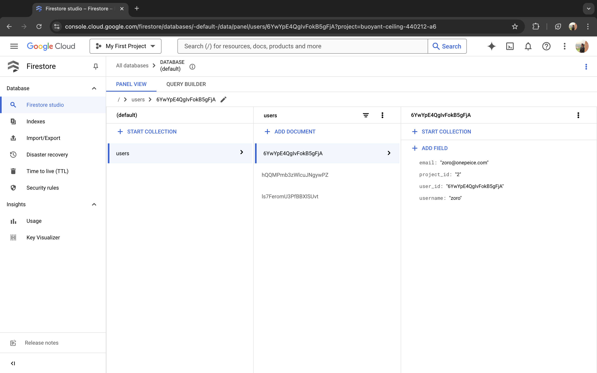
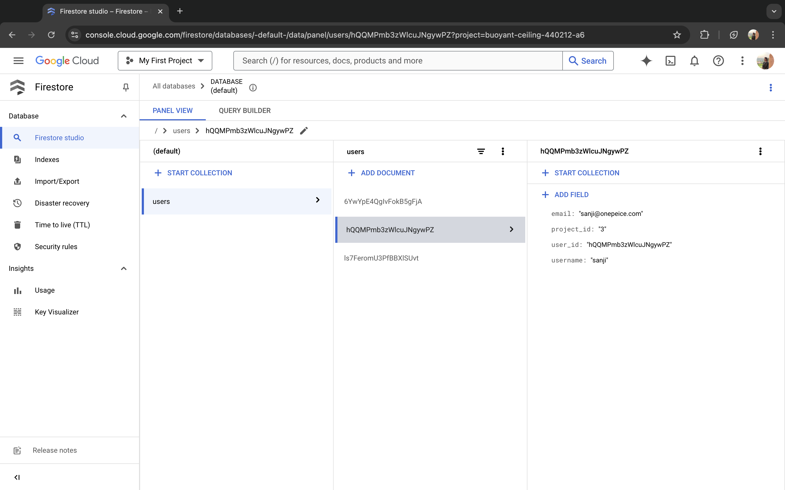

<div align="center">

# FastAPI × Firestore

### User Management API

A Python backend for managing project-associated users with Firestore persistence and email invitations.


[Features](#features) · [Getting started](#getting-started) · [API reference](#api-reference) · [Screenshots](#screenshots)

</div>

---

## Overview

This project brings together FastAPI, Google Cloud Firestore, and FastAPI-Mail in a compact backend. Create users, associate them with a project, update their details, and share API documentation through an HTML email with Firestore screenshots attached.

The application exposes five endpoints, validates incoming user data with Pydantic, and provides interactive API documentation through Swagger UI and ReDoc.

## Features

- **User CRUD** — create, list, update, and delete user records.
- **Project association** — store a `project_id` alongside each user.
- **Persistent storage** — save records in Firestore's `users` collection with generated document IDs.
- **Request validation** — validate required fields and email formats with Pydantic.
- **Email invitations** — send a templated email containing documentation links, the repository link, and two screenshot attachments.
- **Interactive documentation** — explore and call endpoints from Swagger UI, or browse the ReDoc reference.

## Tech stack

| Component | Technology |
| --- | --- |
| API framework | FastAPI |
| Database | Google Cloud Firestore |
| Data validation | Pydantic and Email Validator |
| Email delivery | FastAPI-Mail with Gmail SMTP |
| Email templates | Jinja2 / HTML |
| Local configuration | python-dotenv |
| ASGI server | Uvicorn |

Dependency versions are pinned in [`requirements.txt`](requirements.txt).

## Getting started

### 1. Clone and install

Have Python with `pip` and `venv` available, a Google Cloud project with a Firestore database, and a service-account JSON key with access to that database.

```bash
git clone https://github.com/aniketwdubey/FastAPI-Firestore-User-Management.git
cd FastAPI-Firestore-User-Management

python3 -m venv .venv
source .venv/bin/activate

python -m pip install -r requirements.txt
```

On Windows PowerShell, activate the environment with `.venv\Scripts\Activate.ps1`.

### 2. Configure Firestore

The current implementation reads a service-account key from this exact filename in the repository root:

```text
buoyant-ceiling-440212-a6-86758dd7c004.json
```

Save your own service-account JSON key under that filename, or update `json_path` in [`app/utils/firestore_crud.py`](app/utils/firestore_crud.py) to point to your key. The client uses the project identified by the key and writes to the `users` collection in the default database.

The expected filename is already excluded by `.gitignore`. If you use a different filename, exclude that file too. Keep service-account keys out of version control.

> Firestore initializes when the application imports its routes, so the credential file must be available before starting the server. The current code does not read `GOOGLE_APPLICATION_CREDENTIALS`.

### 3. Configure email

Create a `.env` file in the repository root:

```dotenv
MAIL_USERNAME=your-account@gmail.com
MAIL_PASSWORD=your-smtp-credential
MAIL_FROM=your-account@gmail.com
RECIPIENT_EMAILS=recipient-one@example.com,recipient-two@example.com
```

| Variable | Purpose |
| --- | --- |
| `MAIL_USERNAME` | Gmail SMTP account used to send invitations |
| `MAIL_PASSWORD` | SMTP credential for that account |
| `MAIL_FROM` | Sender email address |
| `RECIPIENT_EMAILS` | Comma-separated invitation recipients, without spaces |

The email module is loaded at startup, so populate the mail settings even when trying the user endpoints. SMTP is configured in [`app/api/email.py`](app/api/email.py) as `smtp.gmail.com` on port `587` with STARTTLS.

Before sending invitations, replace the original deployment URLs and sender signature in [`app/templates/email_template.html`](app/templates/email_template.html) with your own. The original URLs are historical configuration, not a verified live demo.

### 4. Start the server

Run from the repository root:

```bash
uvicorn app.main:app --reload
```

| Resource | Local URL |
| --- | --- |
| Swagger UI | [http://127.0.0.1:8000/docs](http://127.0.0.1:8000/docs) |
| ReDoc | [http://127.0.0.1:8000/redoc](http://127.0.0.1:8000/redoc) |
| OpenAPI schema | [http://127.0.0.1:8000/openapi.json](http://127.0.0.1:8000/openapi.json) |

Open Swagger UI and use **Try it out** to explore the endpoints. There is no route defined at `/`.

## API reference

| Method | Endpoint | Description |
| --- | --- | --- |
| `POST` | `/add_users` | Create a user and return the generated `user_id` |
| `GET` | `/get_users` | List all users in the collection |
| `PATCH` | `/update_users/{user_id}` | Update an existing user's details |
| `DELETE` | `/delete_users/{user_id}` | Delete a user document |
| `POST` | `/send_invite` | Send an invitation to the configured recipients |

### User fields

| Field | Type | Behavior |
| --- | --- | --- |
| `username` | string | Required for create and update |
| `email` | email string | Required for create and update; format validated |
| `project_id` | string | Required for create and update; stored as a project label |
| `user_id` | string | Generated by Firestore and included in user responses |

### Create a user

```bash
curl -X POST http://127.0.0.1:8000/add_users \
  -H 'Content-Type: application/json' \
  -d '{
    "username": "alex",
    "email": "alex@example.com",
    "project_id": "project-001"
  }'
```

Example response (`200 OK`; the actual ID is generated):

```json
{
  "username": "alex",
  "email": "alex@example.com",
  "project_id": "project-001",
  "user_id": "generated-firestore-document-id"
}
```

### List users

```bash
curl http://127.0.0.1:8000/get_users
```

Returns an array of user objects, or `[]` when the collection is empty.

### Update a user

Replace `USER_ID` with the ID returned when creating a user.

```bash
curl -X PATCH http://127.0.0.1:8000/update_users/USER_ID \
  -H 'Content-Type: application/json' \
  -d '{
    "username": "alex-updated",
    "email": "alex@example.com",
    "project_id": "project-002"
  }'
```

Although this route uses `PATCH`, all three input fields are required. A missing user returns `404` with `{"detail": "User not found"}`. Invalid request data returns `422`.

### Delete a user

```bash
curl -X DELETE http://127.0.0.1:8000/delete_users/USER_ID
```

Returns `{"message": "User deleted successfully"}`. The endpoint does not check whether the document existed before deletion.

### Send an invitation

```bash
curl -X POST http://127.0.0.1:8000/send_invite
```

This endpoint takes no request body and sends a real email to every address in `RECIPIENT_EMAILS`. It uses the HTML template and attaches `screenshots/image1.png` and `screenshots/image2.png`; both files must exist. Email delivery is awaited before the endpoint returns.

## Screenshots

Original Firestore console captures showing user documents and their stored fields.



<details>
<summary>View a second user record</summary>



</details>

## Project structure

```text
FastAPI-Firestore-User-Management/
├── app/
│   ├── main.py                     # FastAPI application and router registration
│   ├── api/
│   │   ├── users.py                # User CRUD endpoints
│   │   └── email.py                # SMTP configuration and invitation endpoint
│   ├── schemas/
│   │   └── user.py                 # Request and response schemas
│   ├── models/
│   │   └── models.py               # Additional user model; not used by the routes
│   ├── utils/
│   │   └── firestore_crud.py       # Firestore client and database operations
│   └── templates/
│       └── email_template.html     # Invitation email template
├── screenshots/
│   ├── image1.png
│   └── image2.png
├── .gitignore
├── readme.md
└── requirements.txt
```

## Current scope

This is a small backend project with a focused feature set:

- Routes do not implement authentication or authorization.
- `project_id` is stored with each user; listing users does not filter by project or enforce project isolation.
- Listing users reads the entire collection, without pagination.
- Email addresses are format-validated, but uniqueness is not enforced.
- Firestore calls use the synchronous client inside async endpoints.
- SMTP certificate validation is currently disabled in the email configuration; enable it before a production deployment.
- The repository does not include an automated test suite or deployment configuration.

---

Built by [Aniket Dubey](https://github.com/aniketwdubey).
